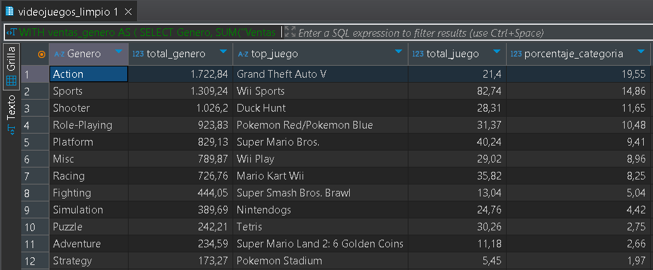
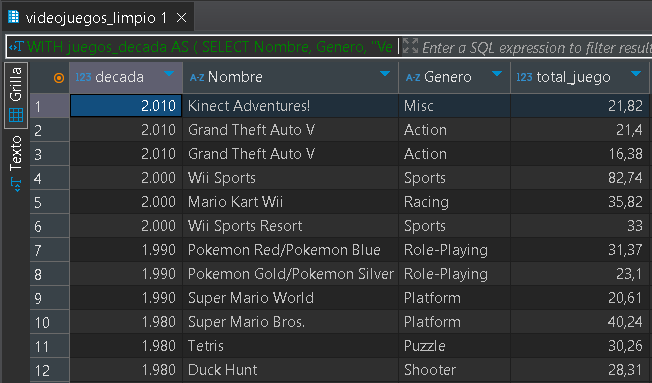
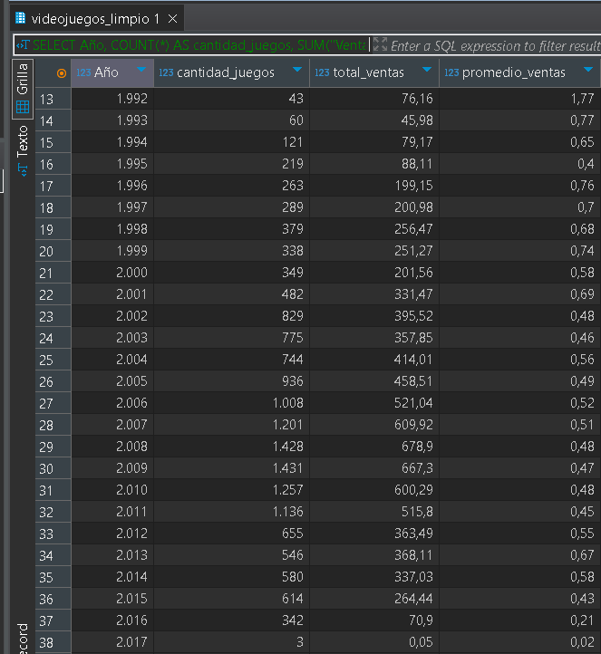
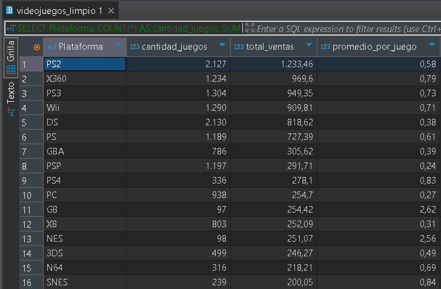
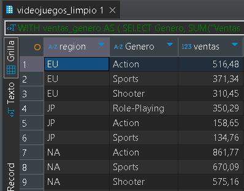

# Análisis de Ventas de Videojuegos

## Descripción del proyecto
Este proyecto analiza un dataset de ventas de videojuegos con el objetivo de identificar patrones de mercado, tendencias a lo largo del tiempo y diferencias entre regiones.

El análisis se enfoca en responder:
- Qué géneros concentran mayor volumen de ventas
- Cómo ha evolucionado el mercado en el tiempo
- Qué plataformas presentan mejor desempeño
- Qué diferencias existen entre regiones como NA, EU y JP

---

## Herramientas utilizadas
- SQL (SQLite / DBeaver)
- Python (pandas para limpieza de datos)
- Git y GitHub

---

## Análisis realizados

**Ventas por género**
- Total de ventas por categoría
- Juego más vendido por género
- Participación de cada género sobre el total

**Top juegos por década**
- Ranking de los juegos más vendidos por década

**Tendencias del mercado**
- Evolución anual de ventas
- Cantidad de lanzamientos por año

**Análisis por plataforma**
- Total de ventas por plataforma
- Cantidad de juegos
- Promedio de ventas por juego

**Análisis por región**
- Comparación de preferencias entre NA, EU y JP
- Identificación de géneros dominantes por región

---

## Resultados

Los siguientes resultados corresponden a las consultas SQL ejecutadas sobre el dataset:

### Ventas por género

### Top juegos por década

### Tendencias del mercado

### Análisis por plataforma

### Análisis por región

---

## Principales hallazgos

- El género Action lidera las ventas globales con un 19.55%, aunque sin un dominio absoluto, lo que refleja un mercado relativamente diversificado.
- El género Sports destaca como segundo en ventas, impulsado principalmente por títulos masivos asociados a consolas específicas como Wii.
- Se observa una diferencia entre géneros que acumulan ventas por volumen y aquellos que dependen de títulos icónicos individuales.
- La PS2 lidera en volumen de juegos y ventas totales, pero no en eficiencia, mostrando un enfoque basado en catálogo amplio.
- Plataformas más recientes como PS4 presentan mayor promedio de ventas por juego, indicando una mayor eficiencia comercial.
- Plataformas antiguas como NES o Game Boy muestran promedios elevados debido a menor cantidad de títulos, lo que debe considerarse al comparar resultados.

---

## Fuente de datos
Dataset de ventas de videojuegos utilizado con fines educativos y de análisis.

---

## Conclusión

El análisis muestra que el mercado de videojuegos presenta una alta diversidad, donde ningún género domina de forma absoluta, aunque Action lidera en participación global.

Se observa que el rendimiento de los géneros no depende únicamente del volumen total de ventas, sino también de la existencia de títulos icónicos que concentran gran parte del éxito comercial.

A nivel de plataformas, se identifica una diferencia clara entre volumen y eficiencia: mientras que la PS2 destaca por la cantidad de juegos y ventas totales, plataformas más recientes como PS4 muestran un mejor rendimiento promedio por título.

Finalmente, el análisis evidencia la importancia de contextualizar los datos, ya que plataformas antiguas presentan promedios elevados debido a un menor número de juegos, lo que puede distorsionar comparaciones directas.

En conjunto, estos resultados reflejan un mercado dinámico, influenciado tanto por tendencias de consumo como por el ciclo de vida de las plataformas.